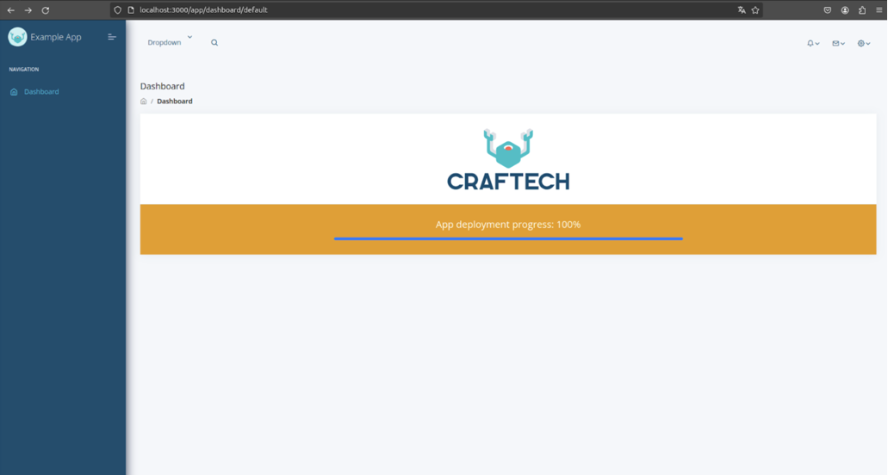
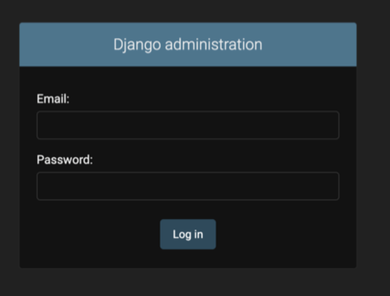
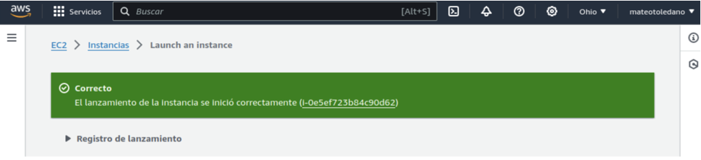
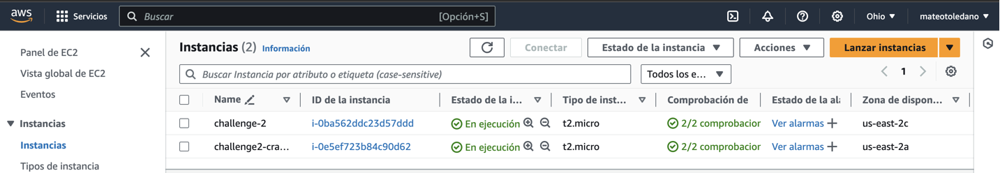

# Prueba 2 - Despliegue de una aplicación Django y React.js

## **Instrucciones para desplegar el proyecto de manera local**

1) Clonar el repositorio:
```bash
git clone <https://github.com/mateotoledano/craftech-challenge.git>
```
2) Mover al directorio raíz del challenge-2:

```bash
cd challenge-2
```

3) Ejecutar el comando para docker-compose para construir y  levantar los servicios:
```bash
sudo docker-compose up --build
```
4) Acceder al proyecto:

Frontend → <http://localhost:3000/>

Backend → <http://localhost:8000/> 


## **Despliegue local**

Para resolver el punto dos de la prueba técnica, seguí una serie de pasos detallados para crear un despliegue dockerizado unificado de la aplicación Django (backend) y React.js (frontend). A continuación explico que fue lo que hice: 

**Clonación del Repositorio:** Primero, cloné el repositorio proporcionado en mi máquina local.
```bash
git clone https://github.com/craftech-inc/devops-interview-ultimate.git
```
```bash
cd devops-interview-ultimate
```

Eliminación de Archivos Docker Compose Individuales: Eliminé los archivos docker-compose.yml existentes en las carpetas frontend y backend para crear un único archivo docker-compose.yml en el directorio raíz del proyecto.

Creación de un Único Archivo Docker Compose: Creé un nuevo archivo docker-compose.yml en el directorio raíz que levanta tanto el frontend como el backend. Este archivo docker-compose.yml se encarga de levantar los Dockerfiles correspondientes para cada servicio.

Modificación de entrypoint.sh: Ajusté el archivo entrypoint.sh en el backend para asegurarme de que el servidor de Django espere a que PostgreSQL esté listo antes de arrancar.

Creación del Archivo .env en Backend: Creé un archivo .env en el directorio raíz del proyecto con las siguientes variables de entorno:
```bash
#Configuración de la base de datos

SQL_DATABASE=postgres

SQL_HOST=db

SQL_PORT=5432
```
Construcción y Levantamiento de los Servicios: Finalmente, construí y levanté los servicios usando Docker Compose desde el directorio raíz del proyecto mediante el comando:
```bash
sudo docker-compose up --build
```
Este comando se encarga de construir y levantar los Dockerfiles correspondientes para cada servicio (frontend, backend y base de datos) definidos en el archivo docker-compose.yml.


### **Justificación del Despliegue**

Opté por usar Docker Compose para gestionar los servicios porque proporciona una forma sencilla y eficiente de definir y ejecutar aplicaciones multi-contenedor. Docker Compose permite aislar cada servicio en su propio contenedor, asegurando que todas las dependencias estén correctamente configuradas y que los servicios puedan comunicarse entre sí sin problemas. Además, facilita la escalabilidad y portabilidad de la aplicación, lo que es ideal para entornos de desarrollo y producción.




## **Despliegue en la nube**

Para desplegar la aplicacion en la nube lo que hice fue lo siguiente: 

**1) Registro en AWS:** Primero, me registré en AWS y configuré mi cuenta para acceder a los servicios de AWS.

**2) Creación de una Instancia EC2:**

- Elegí una AMI adecuada.
- Seleccioné un tipo de instancia t2.micro, que es para el nivel gratuito

3) **Configuración de la Instancia:**

- Configuré el almacenamiento y las opciones de red según las necesidades del proyecto.
- Cree un par de claves para la autenticación SSH.
- Al crear el par de claves, descargué el archivo .pem que usaré para conectarme a la instancia vía SSH.


**4) Lanzamiento de la Instancia:**

- Completé el lanzamiento de la instancia y esperé a que estuviera en estado "running".




**5) Conexión SSH a la Instancia:**

Utilicé el comando SSH para conectarme a la instancia. Primero, di permisos al archivo .pem: 
```bash
chmod 400 my-key.pem
```

Después, me conecté a la instancia utilizando la dirección IP pública de la instancia:
```bash
ssh -i "challenge-2.pem" <ec2-user@ec2-3-143-245-177.us-east-2.compute.amazonaws.com>
```
**6) Instalacion docker y docker-compose**

Una vez dentro de la instancia instale docker y docker-compose mediante los comandos:

Para docker:
```bash
sudo yum update -y 

sudo yum install -y docker

sudo service docker start

sudo usermod -a -G docker ec2-user
```
Para docker compose:
```bash
sudo curl -L "https://github.com/docker/compose/releases/latest/download/docker-compose-$(uname -s)-$(uname -m)" -o /usr/local/bin/docker-compose

sudo chmod +x /usr/local/bin/docker-compose
```

**7) Clonar repositorio y levantar los servicios**

Por ultimo solo queda clonar el repositorio, dirigirse a la carpeta del challenge-2 y ejecutar el comando:
```bash
docker-compose up –build
```
### **Justificación del despliegue en AWS**

Elegi usar AWS por su robustez y popularidad en el despliegue de aplicaciones a gran escala. EC2 proporciona una infraestructura escalable y altamente disponible que es ideal para alojar aplicaciones web. 

Docker y Docker Compose se utilizaron para gestionar los servicios de la aplicación, asegurando que todas las dependencias estén correctamente configuradas y que los servicios puedan comunicarse entre sí sin problemas. Esta configuración facilita la escalabilidad, portabilidad y mantenimiento de la aplicación en un entorno de producción.

# Referencias:

[Curso Craftech ](https://www.youtube.com/playlist?list=PLnf4-vBnJ1n323-UT2TZzj9gzahf_VhTF)

[DockerHub](https://hub.docker.com/)

<https://www.youtube.com/watch?v=bbKcUJVUHzM> 

<https://www.youtube.com/watch?v=3c-OY-sqUpo>

